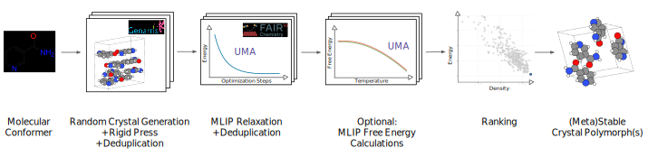

# FastCSP: Accelerated Molecular Crystal Structure Prediction with Universal Model for Atoms

FastCSP is a complete computational workflow for predicting molecular crystal structures for rigid molecules by combining random structure generation and machine learning-based optimization without requiring high-accuracy DFT validation.

## Overview

FastCSP provides an end-to-end workflow for crystal structure prediction that scales from initial structure generation to experimental validation:

<div align="center">

</div>

### Workflow Stages

1. **Structure Generation**: [`Genarris 3.0`](https://github.com/Yi5817/Genarris) generates putative crystal structures.
2. **Deduplication**: Pymatgen's StructureMatcher deduplicates generated structures.
3. **ML Relaxation**: Structures are fully relaxed using the Universal Model for Atoms (UMA) from [`fairchem`](https://fair-chem.github.io/).
4. **Filtering & Deduplication**: Property filtering, structure deduplication using pymatgen's StructureMatcher and validation generates the energy landscape at 0 K.
5. **Experimental Validation** (Optional): Evaluation through comparison against experimental crystal structures using PackingSimilarity from CSD Python API [requires [CCDC license](https://downloads.ccdc.cam.ac.uk/documentation/API/installation_notes.html)] or pymatgen's StructureMatcher.
6. **Free Energy Calculations** (Optional): Free energy corrections are computed and a corrected energy landscape becomes available.

### Key Features

**High-Performance Computing Integration:**
- Native SLURM support for parallel processing across compute clusters
- Automatic job dependency management and fault tolerance
- Scalable from single molecules to large datasets

**Advanced Structure Analysis:**
- Multi-level structure comparison: pre/post-relaxation deduplication
- Configurable similarity metrics for crystallographic matching

**Flexible Workflow Control:**
- Modular stage-based execution - run complete pipeline or individual steps
- Resume capability - skip already completed stages
- Comprehensive logging system with restart capability

### Performance & Scalability

FastCSP is designed for production-scale crystal structure prediction campaigns:
- **Structure Generation**: 500+ structures per molecule within hour (depending on space group and Z complexity)
- **ML Relaxation**: tens of seconds per structure on modern GPUs
- **Structure Comparison**: Efficient parallel processing of large structure databases
- **Memory Usage**: Optimized for large datasets with batching
- **Storage**: Compressed Parquet format for efficient structure storage

## Output Directory Structure

FastCSP creates a well-organized directory structure to manage all data and results:

```
your_project_root/
├── FastCSP.log                     # Main workflow log file
├── molecules.csv                   # Input: Molecule definitions and conformer paths
├── config.yaml                     # Workflow configuration file
│
├── genarris/                       # Stage 1: Raw Genarris structure generation
│   ├── MOLECULE1/
│   │   ├── MOLECULE1_mol_Z1/
│   │   │   ├── ui.conf
│   │   │   ├── slurm.sh
│   │   │   ├── Genarris.out
│   │   │   └── structures.json
│   │   └── MOLECULE1_mol_Z2/
│   └── MOLECULE2/
│
├── raw_structures/                 # Stage 2: Processed and deduplicated structures
│   ├── MOLECULE1/
│   │   ├── MOLECULE1_mol/
│   │   │   └── partition_id=*/
│   │   │       └── *.parquet      # Structures in Parquet format
│   │   └── MOLECULE1_conf2/
│   └── MOLECULE2/
│
└── relaxed/                        # Stage 3+: ML relaxation and analysis results
    └── uma_sm_1p1_omc_bfgs_0.01_1000_relaxcell/  # Named by ML model + optimizer settings
        ├── slurm/                  # SLURM job management files
        │   ├── *.out
        │   ├── *.err
        │   └── submitit_logs/
        │
        ├── raw_structures/         # Stage 3: ML-relaxed crystal structures
        │   ├── MOLECULE1/
        │   │   └── MOLECULE1_mol/
        │   │       └── partition_id=*/
        │   │           └── *.parquet  # Relaxed structures with energies
        │   └── MOLECULE2/
        │
        ├── filtered_structures/    # Stage 4: Energy-filtered and deduplicated structures
        │   ├── MOLECULE1/
        │   │   └── MOLECULE1_mol/
        │   │       └── *.parquet      # Best structures ranked by energy
        │   └── MOLECULE2/
        │
        ├── matched_structures/     # Stage 5: Structures compared to experimental data
        │   ├── MOLECULE1/
        │   │   └── MOLECULE1_mol/
        │   │       └── *.parquet      # Structures with experimental similarity scores
        │   └── MOLECULE2/
```

### Key Data Files

- **Parquet Files**: Compressed columnar storage containing structure data, energies, lattice parameters, and metadata
- **CIF Strings**: Stored within Parquet files for easy structure visualization and analysis
- **JSON Files**: Raw Genarris outputs with structure information
- **Log Files**: Comprehensive workflow logs with timestamps, stage progress, and error tracking

## Getting Started

### Prerequisites
- Python 3.9+
- SLURM cluster environment for parallel processing
- GPU resources for efficient ML relaxations

### Installation
1. Clone the [fairchem repo](https://github.com/facebookresearch/fairchem/tree/main)
2. Install FastCSP: `pip install -e packages/fairchem-applications-fastcsp`

### External Dependencies
- **(Required)** [`Genarris 3.0`](https://github.com/Yi5817/Genarris): Crystal structure generation engine
- **(Optional)** [`CSD Python API`](https://downloads.ccdc.cam.ac.uk/documentation/API/installation_notes.html): For experimental structure comparison (requires license)

### Basic Usage

**Complete Workflow:**
```bash
# Run full crystal structure prediction pipeline
fastcsp --config config.yaml --stages generate process_generated relax filter
```

**Stage-by-Stage Execution:**
```bash
# Generate structures only
fastcsp --config config.yaml --stages generate

# Run relaxation and filtering
fastcsp --config config.yaml --stages relax filter

# Evaluate against experimental data
fastcsp --config config.yaml --stages evaluate
```

**Restart Capability:**
```bash
# FastCSP automatically detects completed stages and resumes from the last incomplete stage
fastcsp --config config.yaml --stages generate process_generated relax filter
```

### Available Workflow Stages

| Stage | Description | Output |
|-------|-------------|--------|
| `generate` | Generate crystal structures using Genarris | `genarris/` directory |
| `process_generated` | Process and deduplicate Genarris outputs | `raw_structures/` directory |
| `relax` | Perform UMA-based structure relaxation | `relaxed/` directory |
| `filter` | Energy filtering and duplicate removal | `filtered_structures/` directory |
| `evaluate` | Compare against experimental data | `matched_structures/` directory |

### Configuration

FastCSP uses YAML configuration files to control all workflow parameters. Example configurations can be found in `core/configs/example_config.yaml`.

**Key Configuration Sections:**
- `molecules`: Path to input molecule CSV file
- `root`: Base directory for all outputs
- `genarris`: Structure generation parameters and SLURM configuration
- `pre_relaxation_filter`: Deduplication tolerances
- `relax`: ML relaxation settings and SLURM configuration
- `post_relaxation_filter`: Property cutoffs and deduplication tolerances
- `evaluate`: Experimental comparison settings
- `logging`: Log file settings and verbosity levels

### Monitoring Progress

FastCSP provides comprehensive logging and progress tracking:

```bash
# Monitor workflow progress
tail -f your_project_root/FastCSP.log

# Check SLURM job status
squeue -u $USER

# View stage completion in log
grep "STAGE COMPLETE" your_project_root/FastCSP.log
```

## Citation

If you use FastCSP in your research, please cite:

```bibtex
@misc{gharakhanyan2025fastcsp,
  title={FastCSP: Accelerated Molecular Crystal Structure Prediction with Universal Model for Atoms},
  author={Gharakhanyan, Vahe and Yang, Yi and Barroso-Luque, Luis and Shuaibi, Muhammed and Levine, Daniel S and Michel, Kyle and Bernat, Viachaslau and Dzamba, Misko and Fu, Xiang and Gao, Meng and others},
  year={2025},
  eprint={2508.02641},
  archivePrefix={arXiv},
  primaryClass={physics.chem-ph},
  url={https://arxiv.org/abs/2508.02641},
}
```

## Support & Contribution

- **Issues**: [GitHub Issues](https://github.com/facebookresearch/fairchem/issues)
- **Discussions**: [GitHub Discussions](https://github.com/facebookresearch/fairchem/discussions)
